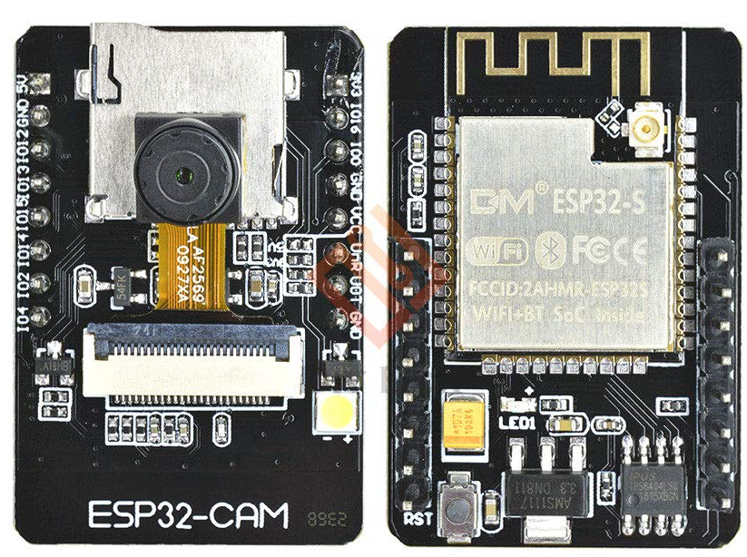

# ESP32-CAM Webcam Template with PlatformIO

## Description

## Configuration

### Camera setting

Default camera SOFT AP Ip - 192.168.1.100

Default wifi password - adminadmin, ssid - chipId (some uint32 number)

Allowed settings:
* appSsid - SOFT APP ssid
* appPass - SOFT APP pass
* stationSsid - STA ssid
* stationPass - STA pass
* frameSize [default 10 (FRAMESIZE_SVGA)] - camera frame size, see enum [here](https://github.com/espressif/esp32-camera/blob/master/driver/include/sensor.h#L87)
* jpegQuality [default 10] - quality of JPEG output. 0-63 lower means higher quality

Example request in [settings.http](settings.http)

**Restart camera after change your settings**

Urls:
* /restart
* /stream
* /settings

### Board configuration

The `platformio.ini` currently configures the project for an ESP-WROVER chipset (has PSRAM), with the flash in QIO mode at 80MHz.

If these settings are not correct for you, change the file with your correct `board = ..` value and other settings accordingly to the [PlatformIO board documentation](https://platformio.org/boards).